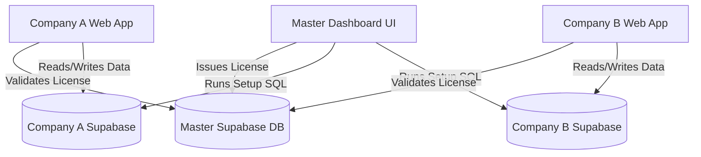

# SaaS Implementation Plan: Master-Tenant Architecture

We are converting the single-tenant "Promoter Management System" into a multi-tenant SaaS. Since you commanded to "continue", I have made the following best-practice architectural decisions:
1. **Master Dashboard**: A separate Next.js app (`master-dashboard`) to manage licenses and onboard companies.
2. **Setup Method**: Self-serve / Automated. The wizard will prompt for the tenant's Supabase Database Password and execute the schema initialization automatically.
3. **Licensing**: Advanced license keys (checking expiry dates, plan tiers, and active status) verified via Edge Functions on the Master database.

## Architecture Diagram

## Phase 1: Database Schema Consolidation
We need a unified `init_schema.sql` file that contains the entire structure of the current codebase:
- Tables: `shareholders`, `share_certificates`, `investments`, `loans`, `dividends`, `agm_sessions`, etc.
- Security: RLS Policies for all tables.
- Seed Data: Default `company_settings`, Admin `roles`, etc.
- This file will be shipped with the Setup Wizard to automatically provision new company databases.

## Phase 2: Master Controller Supabase
We will need to deploy a **new** Supabase project to act as your Master Control.
It will have the following schema:
- `tenants` (id, company_name, contact_email, database_url, status, created_at)
- `licenses` (id, tenant_id, license_key, plan_tier, valid_until, is_active)

We will also deploy an **Edge Function** to this Master Supabase:
- `POST /validate-license`: Accepts a `license_key`. Returns `{ valid: true, tier: 'premium', expiry: ... }`.

## Phase 3: Tenant Web App Modifications (Current Codebase)
The existing codebase (`d:\shree bihani investment pvt ltd`) needs to be modified to be "SaaS aware".
1. **License Verification Layer**: A global layout/middleware check. If the license is expired, show a "Subscription Inactive" page.
2. **Environment Variables**: The app will need `NEXT_PUBLIC_MASTER_API_URL` and `MASTER_API_ANON_KEY` to talk to the Master Supabase for validation.
3. **Branding**: Read company name, logo, and colors from `company_settings` rather than hardcoding "Global Bihani".

## Phase 4: Master Dashboard & Setup Wizard App
We will create a new Next.js application (e.g., `d:\saas-master-dashboard`).
### Setup Wizard Flow:
1. **Welcome**: Enter Company Name & Email.
2. **Database Connect**: User pastes their new Supabase connection string.
3. **Automated Setup**: The UI calls an API route that connects to Postgres (using `pg` library) and runs `init_schema.sql`.
4. **License Generation**: A new license is generated in the Master DB and injected into the tenant's `company_settings`.
5. **Deployment**: Instructions on deploying the frontend via Vercel GitHub integration.

## User Review Required
> [!IMPORTANT]
> Please review the plan. Specifically, confirm if:
> 1. You are okay with creating a **second** Supabase project to act as the Master DB.
> 2. You are okay with creating a **second** Next.js repository for the Master Admin Dashboard.
> 3. You are okay with the Tenant App hitting the Master DB to validate its license key.

If this plan looks good, my next step is to generate the massive `init_schema.sql` that captures the entirety of our current database state.
